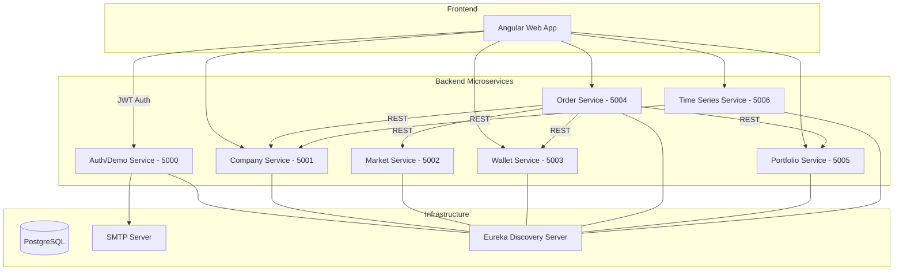
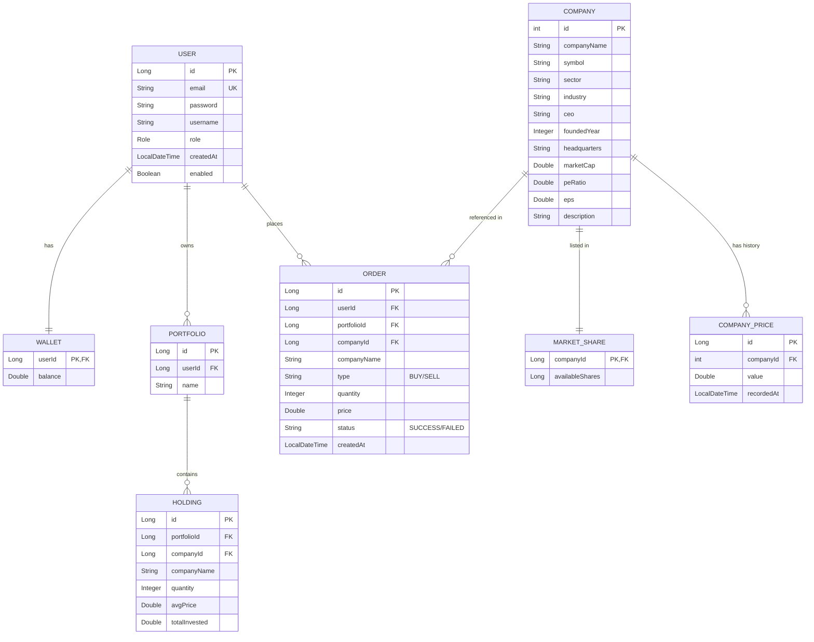

# Project Documentation: StockApp - Microservices Trading Platform

## 1. Introduction
StockApp is a comprehensive, microservices-based stock trading platform that allows users to register, manage their wallets, view real-time company stock prices, and execute buy/sell orders. The project follows a modern architecture with a decoupled frontend and a multi-service backend.

---

## 2. System Architecture

The project is built using a **Microservices Architecture**, where each service is responsible for a specific domain. The services communicate via REST APIs and are registered with a service discovery server.

### 2.1 Architecture Diagram (Mermaid)

---

## 3. Technologies Used

### Backend
- **Java 17**: Core programming language.
- **Spring Boot 4.0.3**: Microservices framework.
- **Spring Data JPA**: For ORM and database interactions.
- **Spring Security & JJWT**: For authentication and JWT-based authorization.
- **Spring Cloud (Netflix Eureka)**: Service discovery.
- **PostgreSQL**: Relational database for all services.
- **Java Mail Sender & Thymeleaf**: For sending OTP and notification emails.
- **Maven**: Build and dependency management.

### Frontend
- **Angular 21**: Modern web framework.
- **Tailwind CSS 4**: For responsive and modern UI styling.
- **Chart.js & ng2-charts**: For real-time stock price visualization.
- **RxJS**: For reactive programming and handling asynchronous data streams.
- **Vitest**: For frontend testing.

---

## 4. Entity-Relationship (ER) Diagram

The data is distributed across multiple microservices, each managing its own schema.

### 4.1 ER Diagram (Mermaid)

---

## 5. Design Patterns

The project implements several key design patterns to ensure scalability, maintainability, and reliability.

1.  **Microservices Architecture**: Decoupling the system into small, autonomous services.
2.  **Saga Pattern (Choreography/Compensation)**: Implemented in the `OrderService` for handling distributed transactions during buy/sell operations with manual rollback (compensation) logic.
3.  **Service Discovery**: Services dynamically register themselves with Eureka, allowing for location transparency.
4.  **Repository Pattern**: Abstracting data access logic using Spring Data JPA.
5.  **DTO (Data Transfer Object)**: Using DTOs for safe data transfer between services and between the backend and frontend.
6.  **Singleton Pattern**: Leveraged via Spring's default bean scope for services and components.
7.  **Observer/Scheduler**: Periodic price generation for companies using `@Scheduled` tasks in the Time Series service.
8.  **Interceptor Pattern**: Angular HTTP interceptors for automatic JWT injection in requests.
9.  **Guard Pattern**: Angular route guards to protect authenticated and admin-only routes.

---

## 6. Project Contributions (Based on Commits)

Contributions from the development team across all branches:

| Hash | Author | Date | Summary |
| :--- | :--- | :--- | :--- |
| `335ca62` | Anish Godse | 2026-03-19 | **Wallet functional**: Implemented core wallet features and integrated with order flow. |
| `617c5fd` | Rohan Pawar | 2026-03-19 | **Frontend trading platform**: Added complete Angular UI, stock charts, and trading features. |
| `145880c` | RahulWissen | 2026-03-18 | **Controller change**: Enhancements to the Company controller. |
| `6a4a9a0` | RahulWissen | 2026-03-18 | **Change in controller**: Price history and time-series related controller updates. |
| `7046cd3` | RahulWissen | 2026-03-18 | **New changes email flow**: Corrected the email notification logic. |
| `5ecd28f` | nikki-infinite | 2026-03-18 | **Auth & SMTP**: Added authentication and SMTP functionality with OTP support. |
| `8a94a5d` | Aryaan Gala | 2026-03-18 | **Added SMTP feature**: Initial implementation of the email service. |
| `b148d56` | Anish Godse | 2026-03-17 | **Frontend commit**: Initial Angular frontend setup and basic components. |
| `228632b` | RahulWissen | 2026-03-17 | **Third update**: Significant updates to the authentication service. |

---

## 7. Key Features by Branch

-   **master**: Latest stable version including Wallet and Order functionality.
-   **GODMODE**: Advanced features including full trading UI, comprehensive data initialization, and OpenAPI/Swagger documentation.
-   **time-series**: Implementation of historical stock price tracking and automated price generators.
-   **auth-smtp-backend / smtp**: Complete email integration for user verification (OTP) and password resets.
-   **frontendupdate**: Major modernizations to the Angular frontend structure and styling.

---

## 8. Setup and Installation

### Backend
1. Ensure PostgreSQL is running.
2. Run each microservice's `pom.xml` via Maven.
3. Important: Start the Discovery Server first (if applicable), followed by other services.

### Frontend
1. Navigate to the `frontend/` directory.
2. Run `npm install`.
3. Start the application with `npm start`.

---

## 9. Conclusion
This documentation provides a high-level and detailed view of the StockApp project. Its microservices approach ensures that each component can be scaled and developed independently, while the use of robust design patterns like Saga ensures data integrity across the system.
